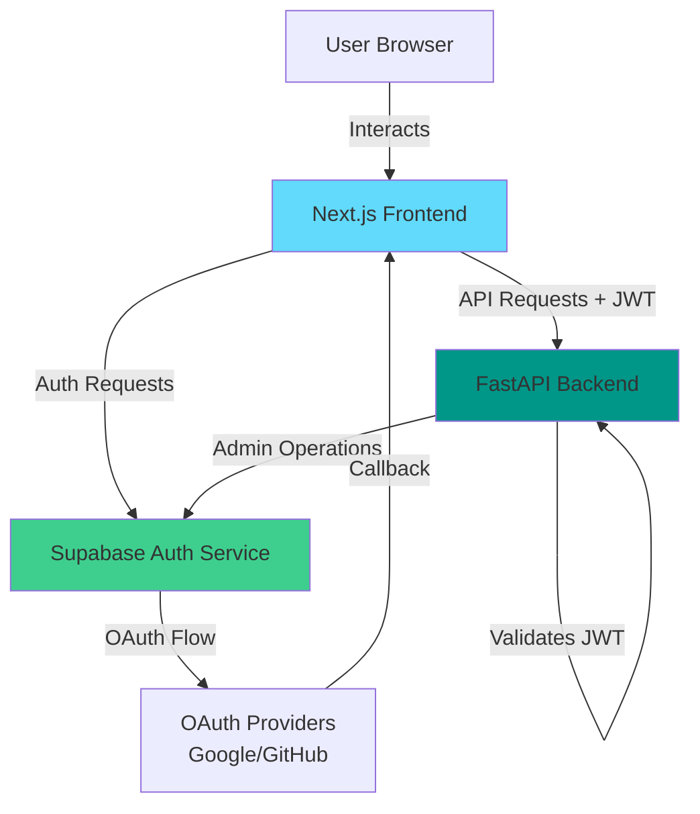
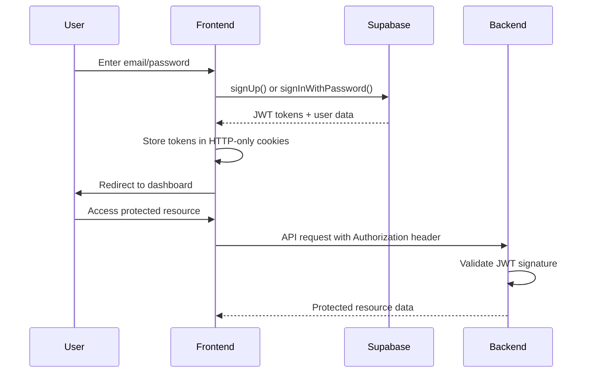
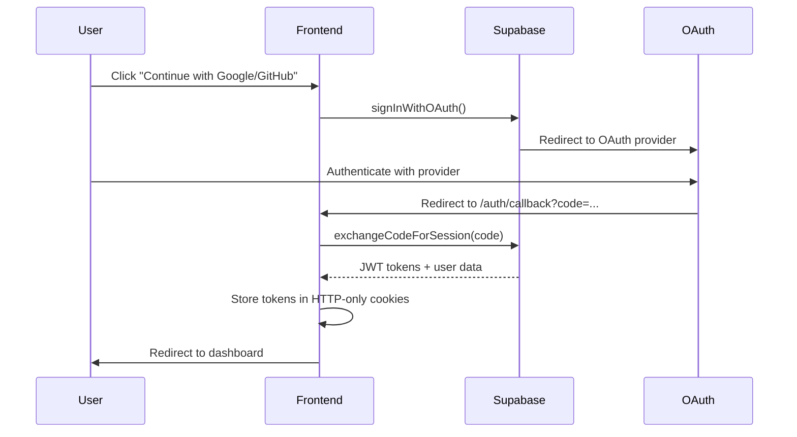

# Design Document: Supabase Authentication

## Overview

This design specifies the implementation of Supabase authentication for a full-stack application with a Next.js frontend and FastAPI backend. The system provides secure user authentication through multiple methods: email/password credentials and OAuth social login (Google and GitHub).

The authentication architecture follows a token-based approach where Supabase Auth serves as the identity provider, issuing JWT tokens that are validated by both frontend and backend. The frontend uses Supabase's JavaScript client library with Server-Side Rendering (SSR) support via the `@supabase/ssr` package, while the backend validates JWT tokens independently using the JWT secret.

**Key Design Principles:**
- **Stateless Authentication**: JWT tokens enable stateless authentication across frontend and backend
- **Secure Token Storage**: HTTP-only cookies prevent XSS attacks on authentication tokens
- **Graceful Degradation**: System handles missing Supabase configuration without crashing
- **Separation of Concerns**: Frontend handles user interaction and session management; backend validates tokens independently
- **PKCE Flow**: OAuth flows use Proof Key for Code Exchange (PKCE) for enhanced security

**Research Summary:**

Based on [Supabase's official documentation](https://supabase.com/docs/guides/auth/server-side/nextjs) and [industry best practices](https://dev.to/zwx00/validating-a-supabase-jwt-locally-with-python-and-fastapi-59jf), the design incorporates:

1. **PKCE Flow for SSR**: Supabase uses PKCE (Proof Key for Code Exchange) for server-side rendering contexts, which provides better security than implicit flow by preventing authorization code interception attacks
2. **JWT Validation**: Backend validates Supabase JWTs locally using the JWT secret, avoiding round-trip verification calls to Supabase
3. **Cookie-based Sessions**: The `@supabase/ssr` package manages authentication state through secure HTTP-only cookies
4. **Token Refresh**: Supabase client automatically refreshes expired access tokens using refresh tokens

## Architecture

### System Components



### Authentication Flows

#### Email/Password Authentication Flow



#### OAuth Authentication Flow (Google/GitHub)



### Component Responsibilities

**Frontend (Next.js)**
- Render authentication UI (login, signup pages)
- Initialize Supabase client with SSR support
- Manage authentication state via React Context
- Handle OAuth redirects and callbacks
- Store session tokens in HTTP-only cookies
- Protect routes requiring authentication
- Attach JWT tokens to API requests

**Backend (FastAPI)**
- Validate JWT tokens on protected endpoints
- Extract user ID from validated tokens
- Provide user context to endpoint handlers
- Use service role key for admin operations
- Return appropriate error responses for invalid tokens

**Supabase Auth Service**
- Authenticate users (email/password, OAuth)
- Issue and refresh JWT tokens
- Manage user accounts and sessions
- Send confirmation emails
- Handle OAuth provider integration
- Enforce password policies

## Components and Interfaces

### Frontend Components

#### 1. Supabase Client (`frontend/src/lib/supabase.ts`)

**Purpose**: Create and configure Supabase browser client for authentication operations.

**Interface**:
```typescript
// Check if Supabase is configured
export const isSupabaseConfigured: boolean

// Create Supabase browser client (singleton)
export function createClient(): SupabaseClient | null

// Create Supabase server client for SSR contexts
export function createServerClient(
  cookieStore: ReadonlyRequestCookies
): SupabaseClient
```

**Implementation Notes**:
- Uses `@supabase/ssr` package for SSR support
- Returns `null` if environment variables are not configured
- Validates that environment variables are not placeholder values
- Browser client is a singleton to avoid multiple instances

#### 2. Auth Context (`frontend/src/lib/AuthContext.tsx`)

**Purpose**: Provide authentication state and methods throughout the React component tree.

**Interface**:
```typescript
interface AuthContextType {
  user: User | null                    // Current authenticated user
  session: Session | null              // Current session with tokens
  loading: boolean                     // Auth initialization state
  isConfigured: boolean                // Whether Supabase is configured
  signOut: () => Promise<void>         // Sign out current user
}

// React hook to access auth context
export function useAuth(): AuthContextType

// Provider component
export function AuthProvider({ children }: { children: ReactNode }): JSX.Element
```

**Implementation Notes**:
- Listens to `onAuthStateChange` for real-time auth updates
- Automatically refreshes expired tokens
- Handles graceful degradation when Supabase is not configured
- Clears legacy localStorage sessions on sign out

#### 3. Login Page (`frontend/src/app/login/page.tsx`)

**Purpose**: User interface for authentication (email/password and OAuth).

**Interface**:
```typescript
export default function LoginPage(): JSX.Element
```

**Features**:
- Email/password form with validation
- Google OAuth button
- GitHub OAuth button
- Error message display
- Loading states for async operations
- Link to signup page

#### 4. Signup Page (`frontend/src/app/signup/page.tsx`)

**Purpose**: User interface for account creation.

**Interface**:
```typescript
export default function SignupPage(): JSX.Element
```

**Features**:
- Email/password/username form
- Password length validation (minimum 6 characters)
- Google OAuth button
- GitHub OAuth button
- Success/error message display
- Link to login page

#### 5. OAuth Callback Route (`frontend/src/app/auth/callback/route.ts`)

**Purpose**: Handle OAuth provider redirects and exchange authorization codes for sessions.

**Interface**:
```typescript
export async function GET(request: Request): Promise<NextResponse>
```

**Implementation Notes**:
- Extracts authorization code from query parameters
- Uses `createServerClient` for SSR context
- Exchanges code for session via `exchangeCodeForSession()`
- Sets authentication cookies
- Redirects to destination URL or dashboard
- Handles errors by redirecting to login with error parameter

### Backend Components

#### 1. Authentication Endpoints (`backend/app/api/v1/endpoints/auth.py`)

**Purpose**: Provide authentication API endpoints (currently stubs for Phase 2 integration).

**Interface**:
```python
@router.post("/auth/signup", response_model=MessageResponse)
async def signup(user_data: UserSignup) -> MessageResponse

@router.post("/auth/login", response_model=MessageResponse)
async def login(user_data: UserLogin) -> MessageResponse
```

**Phase 2 Implementation**:
- `/auth/signup`: Create user in Supabase Auth, return JWT
- `/auth/login`: Validate credentials via Supabase, return JWT
- Both endpoints will integrate with Supabase Python client

#### 2. JWT Validation Middleware (`backend/app/core/security.py`)

**Purpose**: Validate Supabase JWT tokens on protected endpoints.

**Interface**:
```python
def decode_supabase_token(token: str) -> Optional[dict]:
    """
    Decode and validate a Supabase JWT token.
    
    Args:
        token: JWT token from Authorization header
        
    Returns:
        Token payload with user_id if valid, None otherwise
    """
```

**Implementation Notes**:
- Uses `python-jose` library for JWT validation
- Validates signature using JWT secret from environment
- Checks token expiration
- Extracts user ID from `sub` claim
- Returns None for invalid/expired tokens

#### 3. Dependency for Protected Routes

**Purpose**: FastAPI dependency to require authentication on endpoints.

**Interface**:
```python
async def get_current_user(
    authorization: str = Header(None)
) -> str:
    """
    Extract and validate JWT token, return user ID.
    
    Raises:
        HTTPException(401): If token is missing or invalid
        
    Returns:
        User ID from token payload
    """
```

**Usage Example**:
```python
@router.get("/protected")
async def protected_endpoint(
    user_id: str = Depends(get_current_user)
):
    # user_id is guaranteed to be valid here
    return {"user_id": user_id}
```

#### 4. Configuration (`backend/app/core/config.py`)

**Purpose**: Manage environment variables for Supabase integration.

**Configuration Variables**:
```python
class Settings(BaseSettings):
    # Supabase
    SUPABASE_URL: str = ""
    SUPABASE_ANON_KEY: str = ""
    SUPABASE_SERVICE_ROLE_KEY: str = ""
    
    # JWT
    JWT_SECRET: str = "dev-secret-change-in-production"
    JWT_ALGORITHM: str = "HS256"
    ACCESS_TOKEN_EXPIRE_MINUTES: int = 60
```

**Implementation Notes**:
- JWT_SECRET should match Supabase project's JWT secret
- JWT_ALGORITHM should be "HS256" for Supabase
- SERVICE_ROLE_KEY is used for admin operations only

## Data Models

### User Object (Supabase Auth)

The user object returned by Supabase Auth contains:

```typescript
interface User {
  id: string                          // UUID user identifier
  email: string                       // User's email address
  email_confirmed_at?: string         // Email confirmation timestamp
  phone?: string                      // Phone number (if provided)
  created_at: string                  // Account creation timestamp
  updated_at: string                  // Last update timestamp
  user_metadata: {                    // Custom user data
    username?: string                 // Username (if provided during signup)
    display_name?: string             // Display name
    avatar_url?: string               // Profile picture URL (from OAuth)
    [key: string]: any                // Additional custom fields
  }
  app_metadata: {                     // System metadata
    provider: string                  // Auth provider (email, google, github)
    providers: string[]               // All linked providers
  }
  identities?: Identity[]             // Linked OAuth identities
}
```

### Session Object (Supabase Auth)

The session object contains authentication tokens:

```typescript
interface Session {
  access_token: string                // JWT access token
  refresh_token: string               // Token for refreshing access token
  expires_in: number                  // Token expiration time (seconds)
  expires_at?: number                 // Absolute expiration timestamp
  token_type: "bearer"                // Token type
  user: User                          // User object
}
```

### JWT Token Payload

Supabase JWT tokens contain the following claims:

```json
{
  "sub": "user-uuid",                 // Subject (user ID)
  "email": "user@example.com",        // User email
  "role": "authenticated",            // User role
  "aud": "authenticated",             // Audience
  "iss": "https://project.supabase.co/auth/v1",  // Issuer
  "iat": 1234567890,                  // Issued at (timestamp)
  "exp": 1234571490,                  // Expiration (timestamp)
  "user_metadata": {                  // Custom user metadata
    "username": "example_user"
  },
  "app_metadata": {                   // System metadata
    "provider": "google"
  }
}
```

### Backend User Schema

For API requests/responses:

```python
class UserSignup(BaseModel):
    email: EmailStr
    password: str = Field(min_length=6)
    username: Optional[str] = None

class UserLogin(BaseModel):
    email: EmailStr
    password: str

class MessageResponse(BaseModel):
    message: str
    success: bool
```

## Error Handling

### Frontend Error Handling

**Error Categories**:

1. **Configuration Errors**
   - Missing environment variables
   - Invalid Supabase URL/keys
   - **Handling**: Display message that authentication is unavailable, disable auth features

2. **Authentication Errors**
   - Invalid credentials
   - Email already registered
   - Weak password
   - **Handling**: Display error message from Supabase, keep user on current page

3. **Network Errors**
   - Supabase service unavailable
   - Timeout errors
   - **Handling**: Display "connectivity issues" message, allow retry

4. **OAuth Errors**
   - User cancelled OAuth flow
   - OAuth provider error
   - Code exchange failure
   - **Handling**: Redirect to login with error parameter, display appropriate message

**Error Display Strategy**:
- Use color-coded messages (red for errors, green for success)
- Clear previous messages before showing new ones
- Provide actionable guidance (e.g., "Check your email to confirm")
- Distinguish between user errors and system errors

### Backend Error Handling

**Error Responses**:

1. **401 Unauthorized**
   - Missing Authorization header
   - Invalid JWT token
   - Expired JWT token
   - **Response**: `{"detail": "Unauthorized"}`

2. **403 Forbidden**
   - Valid token but insufficient permissions
   - **Response**: `{"detail": "Forbidden"}`

3. **500 Internal Server Error**
   - JWT validation failure
   - Supabase service error
   - **Response**: `{"detail": "Internal server error"}`

**Error Logging**:
- Log authentication failures with user ID (if available)
- Log JWT validation errors with token metadata (not token itself)
- Log Supabase API errors with request context

## Testing Strategy

### Testing Approach

This feature involves authentication flows that are primarily **integration-focused** rather than pure logic suitable for property-based testing. The system integrates with external services (Supabase Auth, OAuth providers) where behavior is deterministic and controlled by those services, not by our code.

**Why Property-Based Testing Does NOT Apply**:

1. **External Service Behavior**: Testing Supabase Auth's behavior (token issuance, OAuth flows, email sending) - this is infrastructure we don't control
2. **Deterministic External Behavior**: JWT validation behavior doesn't vary meaningfully with input - a valid token is valid, an invalid token is invalid
3. **High Cost for Repeated Execution**: Running 100 OAuth flows or Supabase API calls is expensive and doesn't find more bugs than 2-3 examples
4. **Configuration Validation**: Checking that environment variables are set is a one-time setup check

**Therefore, this design OMITS the Correctness Properties section** and focuses on appropriate testing strategies for authentication systems.

### Unit Testing Strategy

**Frontend Unit Tests** (using Jest + React Testing Library):

1. **Supabase Client Configuration**
   - Test `isSupabaseConfigured` returns false with missing env vars
   - Test `isSupabaseConfigured` returns false with placeholder values
   - Test `createClient()` returns null when not configured
   - Test `createClient()` returns client instance when configured

2. **Auth Context**
   - Test initial loading state
   - Test user state updates on auth state change
   - Test signOut clears user and session
   - Test graceful handling when Supabase not configured

3. **Login/Signup Pages**
   - Test form validation (email format, password length)
   - Test error message display
   - Test loading states during submission
   - Test OAuth button click handlers
   - Test navigation links

4. **OAuth Callback Route**
   - Test code extraction from query parameters
   - Test redirect to destination URL
   - Test redirect to dashboard when no destination
   - Test error handling for failed code exchange

**Backend Unit Tests** (using pytest):

1. **JWT Validation**
   - Test valid JWT token decoding
   - Test expired token rejection
   - Test invalid signature rejection
   - Test malformed token rejection
   - Test missing token handling

2. **Protected Route Dependency**
   - Test successful authentication with valid token
   - Test 401 response with missing token
   - Test 401 response with invalid token
   - Test user ID extraction from token

3. **Configuration**
   - Test environment variable loading
   - Test default values for missing variables

### Integration Testing Strategy

**Frontend Integration Tests** (using Playwright or Cypress):

1. **Email/Password Authentication Flow**
   - Complete signup flow with valid credentials
   - Complete login flow with valid credentials
   - Test invalid credentials error handling
   - Test password length validation
   - Test email confirmation message display

2. **OAuth Authentication Flow**
   - Test Google OAuth button initiates redirect
   - Test GitHub OAuth button initiates redirect
   - Test callback handling (mock OAuth provider response)
   - Test successful authentication and redirect to dashboard

3. **Session Management**
   - Test session persistence across page refresh
   - Test automatic token refresh
   - Test sign out clears session
   - Test redirect to login after sign out

4. **Route Protection**
   - Test unauthenticated access redirects to login
   - Test authenticated access allows page render
   - Test destination URL preservation during redirect
   - Test loading state during auth check

**Backend Integration Tests** (using pytest with test client):

1. **End-to-End Authentication**
   - Test protected endpoint with valid Supabase JWT
   - Test protected endpoint with invalid JWT
   - Test protected endpoint without Authorization header
   - Test user ID extraction and usage in endpoint

2. **Supabase Integration** (with test Supabase project)
   - Test user creation via Supabase Python client
   - Test token validation against test project
   - Test service role key operations

### Manual Testing Checklist

**OAuth Provider Setup**:
- [ ] Google OAuth configured in Supabase dashboard
- [ ] GitHub OAuth configured in Supabase dashboard
- [ ] Callback URLs whitelisted in OAuth provider settings
- [ ] Test OAuth flow in production-like environment (HTTPS required)

**Email Configuration**:
- [ ] Email templates configured in Supabase
- [ ] Confirmation emails delivered successfully
- [ ] Email links redirect correctly

**Security Testing**:
- [ ] JWT tokens stored in HTTP-only cookies (not localStorage)
- [ ] Tokens not exposed in client-side JavaScript
- [ ] CORS configured correctly for API requests
- [ ] Token expiration and refresh working correctly

**Error Scenarios**:
- [ ] Graceful handling when Supabase is down
- [ ] Clear error messages for user mistakes
- [ ] Proper error logging without exposing sensitive data

### Test Data Management

**Test Users**:
- Create dedicated test users in Supabase test project
- Use email addresses with `+test` suffix for easy identification
- Clean up test users after test runs

**Environment Separation**:
- Use separate Supabase projects for development, testing, and production
- Never run tests against production Supabase project
- Use environment-specific configuration files

### Testing Tools and Libraries

**Frontend**:
- Jest: Unit testing framework
- React Testing Library: Component testing
- Playwright or Cypress: End-to-end testing
- MSW (Mock Service Worker): API mocking

**Backend**:
- pytest: Testing framework
- pytest-asyncio: Async test support
- httpx: Test client for FastAPI
- python-jose: JWT token generation for tests

### Test Coverage Goals

- **Unit Tests**: 80%+ coverage for authentication logic
- **Integration Tests**: Cover all critical user flows
- **Manual Tests**: Complete checklist before each release

### Continuous Integration

**CI Pipeline Steps**:
1. Run unit tests on every commit
2. Run integration tests on pull requests
3. Run security scans (dependency vulnerabilities)
4. Verify environment variable configuration
5. Deploy to staging environment for manual testing

**Test Environment Setup**:
- Provision test Supabase project in CI
- Configure test OAuth applications
- Set up test environment variables
- Clean up test data after runs
